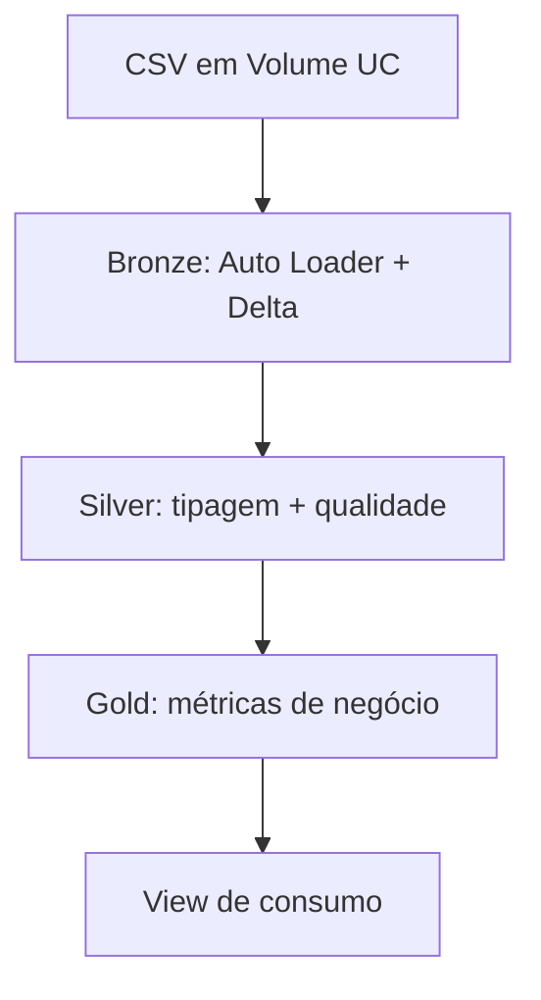

# Mini Lakehouse de Vendas | Databricks

Pipeline de engenharia de dados para transformar arquivos CSV de pedidos e produtos em indicadores de comércio eletrônico. O projeto combina **Unity Catalog**, **Auto Loader**, **Delta Lake**, **SQL** e **PySpark** em uma arquitetura Medalhão, com rastreabilidade, quarentena de registros inválidos e reconciliação entre as camadas.

> **Escopo:** projeto de portfólio desenvolvido no Databricks. O repositório contém o código do notebook; tabelas, dados e permissões pertencem ao workspace em que ele for executado.

## Problema e entregas

Os dados de entrada incluem linhas de pedidos e um cadastro de produtos. O pipeline preserva a origem de cada registro, trata problemas de tipagem e qualidade, consolida pedidos para calcular métricas sem contar uma linha de produto como um pedido inteiro e entrega:

| Produto | Grão | Pergunta atendida |
| --- | --- | --- |
| `gold.monthly_sales_indicators` | Mês | Como evoluem pedidos, receita reconhecida, descontos e entregas? |
| `gold.brand_sales_ranking` | Categoria × marca | Quais marcas contribuem mais para a receita dos pedidos entregues? |
| `gold.customer_segment_performance` | Estado × faixa etária | Quais segmentos priorizar, revisar ou acompanhar? |
| `gold.vw_top_10_brands` | Até dez posições do ranking | Quais indicadores de marcas podem ser expostos para consumo? |

**Receita reconhecida**, neste projeto, é a soma de `total_amount` dos pedidos com status `DELIVERED`. Os demais estados são monitorados separadamente. Os valores monetários permanecem na unidade da fonte, cuja moeda precisa ser confirmada antes de uso financeiro. O projeto não chama receita de lucro: não há custo de mercadoria suficiente para calcular lucro.

## Arquitetura



| Camada | Objetos no catálogo `rower_bootcamp` | Papel |
| --- | --- | --- |
| Landing | `landing.files` | Arquivos CSV e estado técnico da ingestão |
| Bronze | `bronze.orders_raw`, `bronze.products_raw` | Dados brutos em Delta com metadados de origem |
| Silver | `silver.sales`, `silver.sales_quarantine` | Linhas válidas tratadas e versões rejeitadas com motivo |
| Gold | `gold.monthly_sales_indicators`, `gold.brand_sales_ranking`, `gold.customer_segment_performance` | Agregações para análise |
| Consumo | `gold.vw_top_10_brands` | Projeção limitada do ranking |

### Bronze: ingestão incremental

O notebook lê `sales*.csv` e `products*.csv` em `/Volumes/rower_bootcamp/landing/files/desafio/`. Cada fluxo utiliza seu próprio `schemaLocation` e `checkpointLocation` sob `landing.files/_system/autoloader`, com `trigger(availableNow=True)`. Os campos de negócio entram inicialmente como texto; o fluxo acrescenta horário da ingestão e nome, caminho, tamanho e data de modificação do arquivo. A coluna `_rescued_data` permite identificar dados incompatíveis com o esquema declarado.

O checkpoint registra os arquivos já processados. O notebook inclui uma segunda execução para verificar se as contagens da Bronze permanecem estáveis sem novos arquivos, além de um teste de chegada de novo arquivo em um caminho de teste separado.

### Silver: estado atual e qualidade

O grão de `silver.sales` é **uma linha vigente por combinação de `order_id` e `product_id`**, após as regras de validação. A transformação utiliza `TRY_CAST`, aceita formatos de data previstos no código, padroniza identificadores e textos e escolhe uma versão por chave com `ROW_NUMBER`. Registros com campos críticos inválidos são encaminhados a `silver.sales_quarantine`, mantendo o motivo da rejeição.

O cadastro de produtos é associado por `LEFT JOIN`. Pedidos sem correspondência permanecem na Silver e recebem `product_match_status = 'SEM_CADASTRO'`, permitindo avaliar a cobertura do cadastro sem perder a venda. A tabela também expõe atributos de calendário, tempo de entrega e percentual de desconto.

### Gold: métricas no grão correto

Antes dos indicadores por pedido, as linhas de produto são consolidadas no nível do pedido. Os relatórios mensais separam `DELIVERED`, `SHIPPED`, `PROCESSING`, `CANCELLED` e `RETURNED`. O ranking por categoria e marca considera apenas linhas entregues, calcula participação na receita e ordena as marcas por receita reconhecida.

A terceira tabela segmenta por estado e faixa etária. Ela reúne volume, unidades, receita, taxas operacionais e uso de cupom. A recomendação usa parâmetros definidos no próprio SQL: os **15 segmentos** de maior receita são candidatos à priorização; uma soma de taxas de cancelamento e devolução **até 10%** leva a `PRIORIZAR_CAMPANHAS`, acima disso a `REVISAR_EXPERIENCIA`; os demais recebem `MONITORAR`. Esses limites são hipóteses do exercício e devem ser calibrados para um contexto de negócio real.

## Engenharia e controles

| Decisão | Motivo |
| --- | --- |
| Auto Loader com estado persistente por fonte | Permite identificar arquivos novos e testar idempotência da Bronze |
| Campos de entrada como texto na Bronze | Preserva o conteúdo recebido para tratamento posterior |
| Chave de linha derivada de pedido + produto | Respeita o grão da Silver e evita deduplicar o pedido inteiro |
| Quarentena com motivo de rejeição | Torna perdas por qualidade visíveis e auditáveis |
| `LEFT JOIN` com cadastro | Mantém linhas de venda sem produto cadastrado |
| `CREATE OR REPLACE TABLE` na Silver e Gold | Reconstrói deterministicamente o estado analítico a partir da Bronze no escopo deste dataset |
| View com seleção de colunas | Define uma superfície de consumo mais restrita que a tabela Gold completa |

O notebook contém consultas para verificar **linhagem e dados resgatados**, duplicidades na Silver, contagem de rejeições, valores e datas inválidos, distribuição de status, grãos das Golds e diferenças de receita, unidades e pedidos entre Silver e Gold. Também consulta `DESCRIBE DETAIL` e `DESCRIBE HISTORY` para examinar as tabelas Delta. Os resultados dependem dos CSVs e da execução no workspace; este README não presume uma execução aprovada.

## Como reproduzir

### Pré-requisitos

- Workspace Databricks com computação compatível com Unity Catalog e Auto Loader.
- Permissões para criar ou usar o catálogo `rower_bootcamp`, os schemas `landing`, `bronze`, `silver` e `gold`, o Volume e os objetos do pipeline.
- Arquivos de pedidos `sales*.csv` e de produtos `products*.csv` no formato esperado pelas colunas e pelo delimitador `,` definidos no notebook.
- Permissão para `GRANT`, caso a etapa de concessão de acesso seja executada.

### Passos

1. Importe [`Databricks_Projeto_(1).py`](Databricks_Projeto_%281%29.py) como notebook no workspace Databricks e conecte a computação apropriada.
2. Execute as seções de criação do catálogo, schemas e Volume. Caso não possa criar catálogo, ajuste **todas** as referências qualificadas `rower_bootcamp` para um catálogo autorizado.
3. Envie os arquivos CSV ao diretório `/Volumes/rower_bootcamp/landing/files/desafio/`. O notebook verifica se existem arquivos `sales*.csv` e `products*.csv`.
4. Execute o notebook na ordem: Bronze e seus testes, Silver, Gold, view, governança, reconciliações e evidências Delta.
5. Verifique a saída das consultas de qualidade e confirme as diferenças de reconciliação. O teste incremental do notebook cria arquivos temporários em uma área de teste do Volume; revise essa parte antes de executar em um ambiente compartilhado.

Para novos arquivos, mantenha os checkpoints existentes, adicione `sales*.csv` ou `products*.csv` ao diretório de origem, execute novamente a ingestão Bronze e depois reconstrua Silver e Gold. **Apagar checkpoints ou recriar a Bronze sem planejar a carga muda a semântica do teste de idempotência.**

## Governança e publicação

O notebook cria `gold.vw_top_10_brands` e concede `USE CATALOG`, `USE SCHEMA` e `SELECT` na view ao principal informado no widget `consumer_principal`. O valor inicial desse widget é o usuário atual; em ambiente compartilhado, defina um grupo autorizado e confira os privilégios existentes. A view limita as colunas e as posições do ranking, enquanto as permissões do Unity Catalog controlam o acesso.

Antes de publicar no GitHub, use a exportação **sem resultados de execução**. O código `.py` anexado foi verificado sem e-mails ou credenciais aparentes, mas outros formatos de exportação podem incluir resultados de `SHOW GRANTS`, identificadores de usuários, caminhos internos ou dados da execução. Revise também os CSVs antes de disponibilizá-los publicamente. Não inclua arquivos de estado do Auto Loader, segredos ou dados cuja licença não permita redistribuição.

## Estrutura do repositório

```text
.
├── README.md
└── Databricks_Projeto_(1).py
```

No GitHub, crie o repositório, envie os dois arquivos para a **raiz** e faça o commit. O GitHub exibe automaticamente o `README.md` na página inicial. Se renomear o notebook ou movê-lo para `notebooks/`, atualize o link da seção “Como reproduzir”.

## Limites e próximos passos

Este é um pipeline de portfólio com reconstrução integral da Silver e da Gold, nomes de catálogo e caminhos fixos no notebook. Para evoluir a solução: parametrizar ambiente e caminhos; separar testes de carga do processamento regular; automatizar verificações de qualidade e alertas; orquestrar a execução por etapas; avaliar atualizações incrementais na Silver/Gold; e formalizar a origem, a moeda e a licença dos dados.

## Autor

[Rower Bomfim](https://www.linkedin.com/in/rower-bomfim/)
