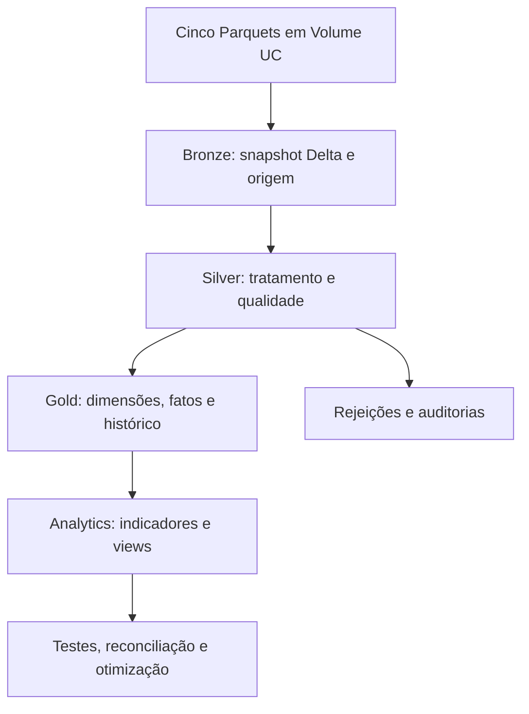

# Nordeste Health Lakehouse

Pipeline de engenharia de dados em **Databricks** para analisar a capacidade
hospitalar cadastrada no Nordeste: estabelecimentos, habilitações, leitos,
profissionais e equipamentos. O projeto usa **Unity Catalog, Volumes,
Delta Lake, PySpark e Spark SQL**, com arquitetura Medalhão, auditorias de
qualidade, modelagem dimensional e indicadores de saúde.

**Autor:** [Rower Bomfim](https://www.linkedin.com/in/rower-bomfim/).  
**Escopo atual:** snapshot da competência configurada `202607`, com as UFs
`AL`, `BA`, `CE`, `MA`, `PB`, `PE`, `PI`, `RN` e `SE`. A rede analisada corresponde
aos cinco arquivos, com estabelecimentos SUS e não SUS conforme a fonte.

> Projeto de portfólio. Os indicadores descrevem o cadastro recebido.
> Quantidades, horas e classificações exigem interpretação conforme os
> contratos de medidas; o cadastro não comprova disponibilidade por turno,
> dedicação exclusiva à UTI ou conformidade assistencial.

## Problema e entregas

Cadastros separados precisam ser relacionados sem multiplicar leitos,
equipamentos ou vínculos profissionais. O pipeline transforma esses arquivos
em tabelas rastreáveis e entrega três perspectivas:

| Indicador | Pergunta de negócio | Grão da tabela atual |
| --- | --- | --- |
| Suporte intensivo | Qual a proporção de horas hospitalares cadastradas de intensivistas e enfermeiros por leito UTI? | CNES + competência |
| Densidade tecnológica | Como o inventário de equipamentos se compara ao cenário parametrizado para cada habilitação de UTI? | CNES + competência + habilitação + equipamento |
| Concentração de especialistas | Como se distribuem ocupações médicas diferenciadas e suas horas hospitalares entre os municípios? | UF + município + competência |

As entregas incluem cinco tabelas Bronze, cinco Silver, tabelas de rejeições e
auditoria, quatro dimensões, duas fatos, uma ponte de habilitações, referências
versionadas, snapshots históricos do modelo Gold e quatro views de consumo.

## Arquitetura

| Camada | Local principal | Responsabilidade |
| --- | --- | --- |
| Landing | `/Volumes/nordeste-health-lakehouse/landing/files` | Armazenar os cinco arquivos de entrada |
| Bronze | `nordeste-health-lakehouse.bronze` | Preservar campos e tipos da origem, adicionando rastreabilidade |
| Silver | `nordeste-health-lakehouse.silver` | Normalizar, filtrar o Nordeste, tratar tipos, validar chaves e registrar rejeições |
| Gold | `nordeste-health-lakehouse.gold` | Modelar, reconciliar, preservar snapshots e materializar indicadores |

## Organização dos notebooks

| Ordem | Notebook | Conteúdo |
| --- | --- | --- |
| 1 | [01_Ingestao_Bronze.py](notebooks/01_Ingestao_Bronze.py) | Infraestrutura, ingestão dos Parquets, preservação de conteúdo e teste de reprocessamento |
| 2 | [02_Tratamento_Silver.py](notebooks/02_Tratamento_Silver.py) | Configuração temporal, normalização, filtros, qualidade, órfãos e contrato de medidas |
| 3 | [03_Modelo_Gold.py](notebooks/03_Modelo_Gold.py) | Referências, dimensões, fatos, ponte, PK/FK, reconciliação, view e histórico |
| 4 | [04_Analytics_Validacao.py](notebooks/04_Analytics_Validacao.py) | Parâmetros, três KPIs, equivalência SQL/PySpark, views, otimização e permissões |

Os arquivos estão no formato Databricks SOURCE: primeira linha
`# Databricks notebook source`, células separadas por `# COMMAND ----------`
e células SQL/Markdown identificadas por `# MAGIC`.

## Arquivos e recorte temporal

Os nomes esperados no Volume são:

- `estabelecimentos_de_saude.parquet`
- `habilitacoes.parquet`
- `leitos.parquet`
- `profissionais.parquet`
- `equipamentos.parquet`

A Silver associa os campos reais da origem por meio de `MAPEAMENTO`. A base de
estabelecimentos não contém `COMPETEN` e recebe a competência do parâmetro.
A célula `EVIDENCIA_TEMPORAL` registra a fonte e a conferência manual informadas
pelo autor, e o contrato preserva `competencia_estabelecimentos_atribuida`.
A referência a uma página geral do CNES identifica a fonte declarada; a
compatibilidade do arquivo específico com o mês precisa ser conferida.

## Bronze: carga completa e rastreabilidade

Cada arquivo é lido como Parquet e gravado em uma tabela Delta correspondente.
A função `ingestar_snapshot` adiciona `arquivo_origem`, obtido de
`_metadata.file_path`, e `data_hora_carga`. A gravação usa `overwrite`, com
verificações de contagem, tipos e presença dos metadados.

A validação de conteúdo usa `exceptAll` nos dois sentidos, preservando também
a multiplicidade dos registros. O reprocessamento compara o estado anterior
via versão Delta com o novo snapshot, desconsiderando os campos técnicos de
carga. Essa estratégia reconstrói o snapshot atual e verifica a estabilidade
do conteúdo de negócio para a mesma entrada.

## Silver: qualidade e contratos

O tratamento padroniza nomes em `snake_case`, preserva identificadores como
texto, valida formatos antes de preencher zeros à esquerda e converte
quantidades e horas para tipos decimais. O recorte geográfico utiliza os
códigos de UF presentes em `CO_UF` ou no prefixo de `CODUFMUN`.

Duplicatas exatas são identificadas pelo hash do conteúdo de origem.
Conflitos que permanecem na chave de negócio são materializados em
`<base>_conflitos_chave` e interrompem o processamento para investigação.
Registros inválidos e referências a estabelecimentos ausentes são registrados
em tabelas de rejeição; os órfãos também possuem perfis agregados por CNES.

| Campo da fonte | Medida adotada | Interpretação |
| --- | --- | --- |
| `QT_EXIST` | Quantidade de leitos | Leitos existentes cadastrados |
| `QT_USO` | Quantidade de equipamentos | Equipamentos em uso cadastrados |
| `HORAHOSP` | Horas hospitalares semanais | Carga horária hospitalar cadastrada por vínculo |
| `HORA_AMB`, `HORAOUTR` | Medidas separadas | Componentes mantidos separadamente da medida hospitalar |

`silver.auditoria_qualidade` reconcilia entrada, exclusões, inválidos, órfãos,
duplicatas e aceitos. A diferença deve ser zero. `silver.contrato_medidas`
registra competência, UFs, medidas, evidência temporal e alerta de cobertura.
O limiar de órfãos é operacional e não representa regra assistencial.

## Gold: modelo dimensional

| Objeto | Grão / chave de negócio | Função |
| --- | --- | --- |
| `dim_estabelecimento` | CNES + competência | Localização e identificação da unidade no snapshot |
| `dim_profissional` | Identificador profissional + CBO | Ocupação, classificação e ID analítico pseudonimizado |
| `dim_tipo_leito` | Código do tipo de leito | Tipo, modalidade UTI e classificação |
| `dim_equipamento` | Código do equipamento | Recurso e descrição |
| `fato_capacidade_hospitalar` | CNES + competência + classe + código do recurso | Quantidades de leitos e equipamentos |
| `fato_alocacao_profissionais` | Chave do vínculo validado na Silver | Carga horária hospitalar por alocação |
| `ponte_estabelecimento_habilitacao` | CNES + competência + habilitação | Habilitações associadas à unidade |

As chaves substitutas são derivadas por SHA-256. As dimensões de recursos
incluem membros para o recurso não aplicável, permitindo relacionar leitos e
equipamentos na mesma fato de capacidade. As quantidades são agregadas no
grão de cada recurso antes dos joins.

A Gold confere chaves únicas, referências e cardinalidades; reconcilia as
somas de leitos, equipamentos e horas com a Silver por CNES e competência.
Os identificadores profissionais originais são substituídos na dimensão por
representações pseudonimizadas.

As quatro tabelas `ref_*` armazenam fonte e versão de classificação. A versão
corrente é `2026-09-29_v1`; conteúdo diferente para uma versão já registrada
causa falha. Novas versões são acrescentadas explicitamente.

### Histórico

Os sete objetos do modelo recebem cópias `historico_<objeto>`, com
`competencia_snapshot` e `escopo_ufs_snapshot`. O reprocessamento substitui
somente o recorte correspondente por `replaceWhere`; conteúdo e schema são
conferidos após a gravação. As tabelas principais representam o snapshot
atual. O histórico implementado cobre o modelo dimensional; os KPIs atuais
são reconstruídos a cada execução.

## Indicadores

### KPI 1 — Suporte intensivo

`kpi1_suporte_intensivo_pyspark` e `kpi1_suporte_intensivo_sql` calculam horas
hospitalares de intensivistas e enfermeiros por leito UTI, com contagem
distinta de profissionais. O notebook compara os tipos e todas as colunas
selecionadas, além do conteúdo nos dois sentidos com `exceptAll`.

As metas quantitativas estão configuradas como `None`. Unidades com leitos
recebem `SEM_META_DE_REFERENCIA`; unidades sem leitos UTI recebem
`SEM_LEITOS_UTI_CADASTRADOS`. Divisões com denominador zero produzem valor
nulo. A proporcionalidade usa horas cadastradas na unidade e não demonstra
cobertura de escala específica da UTI.

### KPI 2 — Densidade tecnológica

`kpi2_densidade_tecnologica` relaciona habilitações UTI, leitos por modalidade
e inventário total da unidade. O cenário `cenario_uti_v1` usa um equipamento
cadastrado por leito da modalidade para os recursos selecionados, como
ventilador e monitor de ECG, incluindo incubadora no recorte neonatal.

A diferença calculada é `max(quantidade_minima - quantidade_cadastrada, 0)`
quando há uma regra quantitativa válida. Regras ausentes ou sem leitos-base
produzem estados próprios, evitando interpretar uma falta de referência como
atendimento à meta. O coeficiente é uma hipótese analítica do portfólio.

**Agregação:** o mesmo inventário pode aparecer em mais de uma habilitação.
Estoques e déficits dessas linhas não devem ser somados indiscriminadamente.
A Gold contém um teste sintético de consolidação; na versão publicada essa
função de teste não materializa um estoque único nem substitui o KPI real.

### KPI 3 — Concentração de especialistas

`kpi3_concentracao_especialistas` agrega profissionais, médicos, ocupações
médicas diferenciadas e suas horas por município. Os denominadores dos
percentuais são explícitos, e médicos sem classificação permanecem visíveis.
CBO representa ocupação cadastral; não comprova título ou registro de
especialidade. Ausência no recorte significa ausência no cadastro analisado.

### Views de consumo

| View | Conteúdo |
| --- | --- |
| `vw_capacidade_hospitalar` | Leitos e equipamentos por unidade e recurso |
| `vw_suporte_intensivo` | Resultado SQL do KPI 1 |
| `vw_densidade_tecnologica` | Detalhamento do KPI 2 por habilitação e equipamento |
| `vw_concentracao_especialistas` | Resultado municipal do KPI 3 |

## Validações e desempenho

O código contém verificações de preservação da Bronze, estabilidade do
reprocessamento, tratamento de rejeições, chaves e órfãos na Silver,
reconciliação de `HORAHOSP`, PK/FK e cardinalidade na Gold, equivalência do
KPI 1 entre APIs, classificações de negócio e limites numéricos dos KPIs.

A etapa de otimização confere o formato Delta e a configuração de clustering,
define colunas para estatísticas de data skipping, recalcula essas
estatísticas e executa `OPTIMIZE ... ZORDER BY (uf, id_municipio)` em três
tabelas Gold. O benchmark consulta a soma de leitos em Recife/PE em versões
Delta anteriores e posteriores, alterna as execuções, aquece a consulta e
registra três amostras medidas por fase, mediana e plano de execução.
Cache, computação e contexto de execução influenciam os tempos observados.

## Resultados registrados no DBC recebido

A tabela abaixo resume as saídas de auditoria existentes no arquivo
`nordeste-health-lakehouse (1)(1).dbc`. São evidências exportadas pelo autor,
referentes ao dataset utilizado; a publicação no GitHub não executa Spark.

| Base | Linhas na Bronze | Linhas aceitas na Silver Nordeste |
| --- | ---: | ---: |
| `estabelecimentos_de_saude` | 633.759 | 113.090 |
| `habilitacoes` | 34.834 | 9.069 |
| `leitos` | 51.808 | 14.332 |
| `profissionais` | 6.727.867 | 1.556.715 |
| `equipamentos` | 1.106.848 | 245.964 |

A Bronze registra **8.555.116 linhas**, distribuídas pelos cinco arquivos.
As saídas mostram preservação de conteúdo/tipos e cinco testes de
reprocessamento com `PASSOU`. A auditoria Silver apresenta diferença zero nas
cinco bases, quatro registros profissionais inválidos e zero órfãos no
recorte registrado. Esses valores dependem dos arquivos de entrada.

## Como executar no Databricks

### Pré-requisitos

- Workspace e computação compatíveis com Unity Catalog, Volumes, Delta Lake
  e os comandos de estatísticas e otimização utilizados nos notebooks.
- Permissões para criar ou utilizar catálogo, schemas, Volume, tabelas e views.
- Os cinco arquivos Parquet com os campos definidos em `MAPEAMENTO`.
- Conferência da competência, fonte e significado das medidas.

### Execução

1. Obtenha a pasta deste projeto e importe os quatro arquivos `.py` como
   notebooks no workspace. Preserve a ordem indicada nos nomes.
2. Confira o catálogo `nordeste-health-lakehouse`. Para usar outro catálogo,
   ajuste **todas** as referências Python e SQL dos quatro notebooks.
3. Execute as células iniciais da Bronze que criam catálogo, schemas e Volume.
4. Envie os cinco Parquets ao Volume `landing.files`, com os nomes esperados.
5. Execute a Bronze completa e confira suas auditorias e reprocessamento.
6. Na Silver, revise `COMPETENCIA`, `EVIDENCIA_TEMPORAL`, mapeamento e UFs;
   execute o tratamento e confira rejeições, órfãos e `contrato_medidas`.
7. Execute a Gold; confira PK/FK, reconciliações e snapshots históricos.
8. Execute Analytics; confira parâmetros, testes, equivalência e otimização.
9. Configure `GRUPO_CONSUMO` se for conceder acesso. Consulte as views com um
   usuário pertencente ao grupo para verificar o consumo efetivo.

Execute cada notebook do início ao fim, em sua própria sessão. Para uma
primeira execução isolada, use uma cópia com catálogo e Volume de teste e
os mesmos arquivos de entrada. Confira os resultados novamente depois das
alterações locais de ordem documentadas em [PUBLICACAO.md](docs/PUBLICACAO.md).

### Orquestração

A ordem prevista para um Job é **Bronze → Silver → Gold → Analytics**, com
quatro tarefas dependentes e uma execução concorrente. A exportação contém
essa orientação; a configuração do Job deve ser criada no workspace.
Defina a computação, os caminhos reais dos notebooks e a política de
recuperação antes de agendar cargas. O repositório não presume que esse
Job ou suas permissões já estejam configurados.

### Reprocessamento e evolução mensal

A mesma carga pode ser executada novamente para conferir estabilidade das
contagens e dos valores. A Bronze e as tabelas principais Silver/Gold são
reconstruídas; o modelo histórico substitui somente o mês/recorte escolhido.
Para outro período, obtenha arquivos compatíveis, registre sua origem,
revise a competência e confira o histórico preservado. A prova de ingestão
de um segundo mês exige esses arquivos e uma execução correspondente.

## Governança e status das configurações

`GRUPO_CONSUMO` está como `None` no código recebido. Nessa configuração, o
notebook registra que as concessões não foram executadas. Ao informar um
grupo existente, a célula concede uso do catálogo/schema e leitura das
quatro views. A confirmação de acesso exige teste com o consumidor.

As views atuais usam `CREATE OR REPLACE VIEW`; revise as concessões ao
reprocessar ou adote `ALTER VIEW` em uma evolução que preserve permissões.
Os notebooks publicados mantêm código e Markdown em formato SOURCE,
facilitando revisão e controle de versões. Os arquivos de entrada e o estado
do workspace são obtidos e configurados separadamente.

## Limites atuais e evolução

- Carga completa por snapshot, com nomes de catálogo e caminhos fixos.
- Competência de estabelecimentos atribuída e conferida manualmente.
- Metas de horas por leito sem referência quantitativa preenchida.
- Estoque do KPI 2 repetido no detalhe por habilitação; consolidação de
  produção e tratamento de compartilhamento entre modalidades são evolução.
- Alguns nomes municipais aparecem como `NAO INFORMADO`; os agrupamentos
  utilizam o identificador municipal disponível.
- Job, grupo consumidor e prova de outra competência dependem do workspace.

As próximas etapas são consolidar o inventário do KPI 2 no grão físico do
recurso, parametrizar ambientes e lotes, materializar a operação do Job,
conferir consumo com um grupo real e demonstrar a evolução temporal com
novos arquivos. Referências normativas quantitativas só devem ser incluídas
após validação de escopo e aplicabilidade.

## Proveniência da publicação

Esta versão deriva do arquivo `nordeste-health-lakehouse (1)(1).dbc` enviado
pelo autor. A conversão preserva as células únicas e aplica três ajustes de
organização: evidência temporal antes da validação Silver, view Gold depois
das fatos/reconciliação e remoção da segunda cópia de uma célula Analytics.
O registro detalhado e as verificações de publicação estão em
[docs/PUBLICACAO.md](docs/PUBLICACAO.md). A sintaxe e o formato SOURCE foram
verificados localmente; a execução integral depende do ambiente Databricks.
